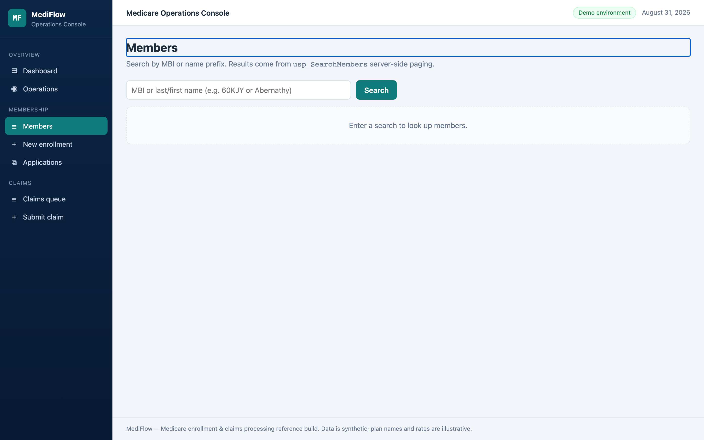
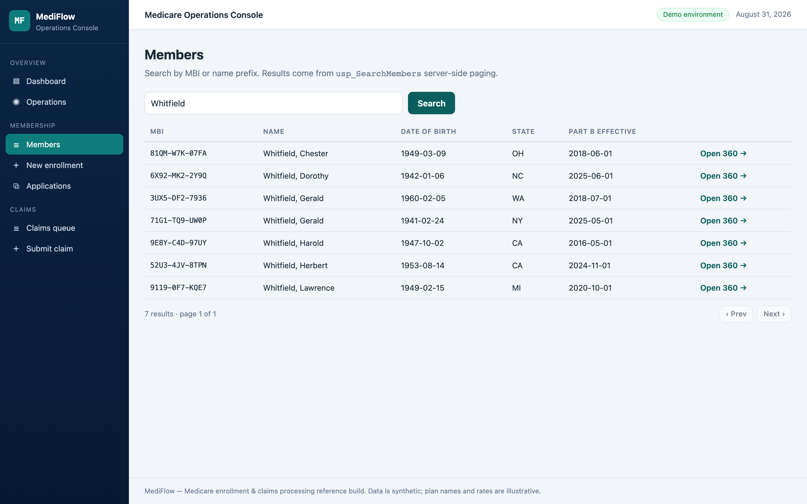

<p align="center">
  
</p>

# MediFlow

**Medicare enrollment and claims adjudication for a plan's operations team: staff enroll
members under the real eligibility rules, provider claims are priced and decided by a
rules engine, and every decision carries its audit trail.**

[](https://github.com/Alex5350/mediflow/actions/workflows/ci.yml)
[](https://github.com/Alex5350/mediflow/actions/workflows/security.yml)


> **Two ways to read this page.** Not an engineer? Everything below the pictures stays in
> plain language, and jargon links to the [glossary](docs/GLOSSARY.md). Engineer? The deep
> dive lives in [TECHNICAL.md](TECHNICAL.md): architecture, flows, and every major
> decision mapped back to the business problem it solves.

## The problem

A Medicare plan's operations team works a three-way exchange: members (the people covered)
who must end up in the right plan, providers (the clinicians and facilities that bill for
care) who expect correct payment, and the plan's own money. When enrollment and claims run
on spreadsheets and manual checks, the same failures repeat. A member lands in the wrong
plan because nobody re-checked Medicare's enrollment windows. Claims pile up faster than
staff can price them, and a denial goes out without an explanation anyone can point to.
And a manual handoff between systems can drop a claim entirely or pay a provider twice,
with no record of which happened.

MediFlow is the console operations staff work from instead: enrollment applications are
checked against the real eligibility rules before anything is saved, every claim is
[adjudicated](docs/GLOSSARY.md) by one engine whose decisions land whole, and every state
change is written to an audit trail nobody can edit.

## The product in pictures

| | |
|---|---|
|  | **Operations dashboard** - pipeline KPIs, denial mix by CO/PR code, plan portfolio with premium volume. |
|  | **Enrollment wizard** - member → plan → effective date, with the eligibility rules evaluating server-side before submission. |
|  | **Claim detail / [EOB](docs/GLOSSARY.md)** - line-level remittance (allowed, plan pays, member owes, adjustment codes), audit timeline, pend and dry-run preview actions. |
|  | **Member 360** - active coverage, full enrollment history, claims with YTD totals from one stored procedure. |
|  | **Member lookup** - the front door to membership: start a search by name or [MBI](docs/GLOSSARY.md). |
|  | **Member search results** - type a few letters of a name or an MBI fragment; each match opens straight into the member's 360 view. |
|  | **Claims queue** - status-filtered, server-paged via `usp_ClaimsQueue`. |
|  | **Verification queue** - approve or deny pending SEP applications; transitions are state-machine guarded. |
|  | **Operations** - outbox depth, dead letters with re-queue, runbook pointers. |
|  | **Claim intake** - [NPI](docs/GLOSSARY.md) check-digit validation and line rules before anything enters the queue. |

Subject-matter art below is original (fictional carrier, identifiers, amounts):

<p align="center">
  
</p>

## What it delivers

- **Enrollments checked before they exist.** The wizard runs Medicare's real enrollment
  windows ([AEP, ICEP and qualifying SEPs](docs/GLOSSARY.md)) server-side before anything
  is saved, and reports every rule violation at once instead of one at a time.
- **Claims that price all at once, never half-applied.** When the engine decides, the
  whole decision lands together: claim totals, every line, the member's benefit tallies,
  and the audit entry. There is no moment where a claim is half-paid.
- **Concurrent workers without double-paying.** Two or more adjudication workers drain
  the same queue and can never take the same claim. A crashed worker's claims return to
  the queue on their own, and a claim that fails five times stops for operator review
  instead of silently disappearing.
- **Every decision carries its audit trail.** Submitted, pended, adjudicated,
  dead-lettered, approved, denied: each state change is recorded append-only with who or
  what did it, when, and the decision details, and there is no path that edits history.
- **An assistant that can look but not touch.** An AI assistant connected through the
  [MCP server](docs/GLOSSARY.md) answers operational questions (who owes what on a claim,
  why it was denied) from the same views the dashboard uses, read-only by design.
- **Money exact to the cent.** Every amount is computed as whole cents under a single
  rounding rule, so the engine, the database, and every report agree on every penny.

## How the engineering solves it

Plain-terms bridge; each item links to the full story in [TECHNICAL.md](TECHNICAL.md).

- **A claim handoff must never be lost or double-processed.** The claim and its work
  ticket are written in the same database transaction, and workers check out claims under
  expiring leases, so a provider is paid exactly once even if a worker crashes
  mid-decision. ([the lost-claim and double-payment races](TECHNICAL.md#how-the-tech-solves-the-business-problem))
- **A 20-line claim must price in one step.** The decision for the whole claim, every
  line, and the member's running benefit totals travel to the database as a single typed
  batch, so no reader ever sees a claim that is partially decided.
  ([the one-round-trip commit](TECHNICAL.md#how-the-tech-solves-the-business-problem))
- **Money must land on the same cent everywhere.** All amounts are integer cents with one
  rounding rule shared by the engine, the database, and the tests, so a disputed penny has
  one line of code to point at.
  ([integer cents](TECHNICAL.md#how-the-tech-solves-the-business-problem))
- **The rules have to actually run.** Claims pass through an ordered rules pipeline whose
  wiring is covered by integration tests, after a bug once let an empty rule chain
  silently pay every claim.
  ([the empty-pipeline bug](TECHNICAL.md#how-the-tech-solves-the-business-problem))
- **Staff questions deserve answers, not exports.** The same read-only views behind the
  dashboard are exposed to an AI assistant through the MCP server, including a dry-run
  preview that runs the real engine without writing anything.
  ([read-only by design](TECHNICAL.md#security-and-operations))

<details>
<summary><b>For developers: quickstart</b></summary>

Prerequisites: .NET SDK 10, Docker (SQL Server container), and, for the E2E suite, Node 22
plus `sqlcmd` ([docs/onboarding.md](docs/onboarding.md)).

```bash
./scripts/start.sh        # SQL Server container + all four services + deterministic seed
open http://localhost:8090
```

The seed generates 160 members, 16 plans across two contract years, and ~500 claims whose
paid outcomes are priced by the **actual adjudication engine** - accumulators, denial
rollups, and YTD figures are internally consistent, not random noise. Claim numbers you
can explore immediately: open the claims queue, filter **Received**, and watch the worker
drain it while the detail pages update.

| Surface | URL |
|---|---|
| Staff dashboard | http://localhost:8090 |
| Enrollment API (OpenAPI/Scalar) | http://localhost:8080/scalar/v1 |
| Claims API (OpenAPI/Scalar) | http://localhost:8081/scalar/v1 |

Everything else - E2E suite, isolated databases, resets, teardown - is one command each:
[`docs/onboarding.md`](docs/onboarding.md).

</details>

## Documentation

| Document | What it covers | Audience |
|---|---|---|
| [TECHNICAL.md](TECHNICAL.md) | Architecture, request flow, decisions mapped to business problems, stack rationale, testing, security | Engineers |
| [docs/GLOSSARY.md](docs/GLOSSARY.md) | Every term this repo uses, Medicare and engineering, in plain English and precisely | Everyone |
| [docs/architecture.md](docs/architecture.md) | Context/container views, request lifecycle walkthrough | Engineers |
| [docs/onboarding.md](docs/onboarding.md) | Day-one setup, repo tour, add-a-feature walkthrough | Engineers |
| [docs/domain.md](docs/domain.md) | Medicare concepts, CO/PR codes, worked adjudication example | Engineers |
| [docs/query-tuning.md](docs/query-tuning.md) | Index decisions with measured before/after reads | Engineers |
| [docs/mcp-server.md](docs/mcp-server.md) | The 8 tools, client wiring, safety model | Engineers |
| [docs/security.md](docs/security.md) | Auth model, pipeline, threat notes | Engineers |
| [docs/runbook.md](docs/runbook.md) | Incident playbooks, metrics, escalation thresholds | Operators |
| [docs/testing.md](docs/testing.md) | Running and writing tests in every tier | Engineers |
| [docs/design-notes.md](docs/design-notes.md) | Hard problems and how they were resolved | Engineers |
| [docs/adr/](docs/adr/) | Eight architecture decision records | Engineers |

## License

[MIT](LICENSE)

---

All data is synthetic. Plan names, carriers, rates, MBIs, and NPIs are generated; "Cascade Mutual Health" and "Northbridge Care Network" are fictional. This project is not affiliated with any government program or insurer.
