<p align="center">
  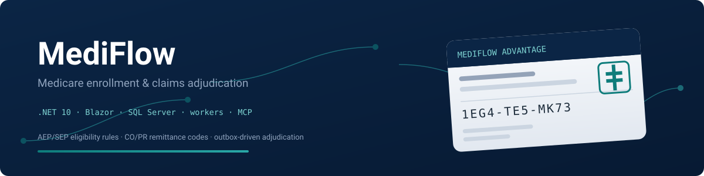
</p>

# MediFlow

**A Medicare enrollment and claims-adjudication platform built the way enterprise .NET shops build them**: two minimal APIs, a Blazor staff console, an outbox-driven adjudication worker, and a read-only MCP server — all against SQL Server with stored procedures, full test tiers, and a DevSecOps pipeline.

[](https://github.com/Alex5350/mediflow/actions/workflows/ci.yml)
[](https://github.com/Alex5350/mediflow/actions/workflows/security.yml)


---

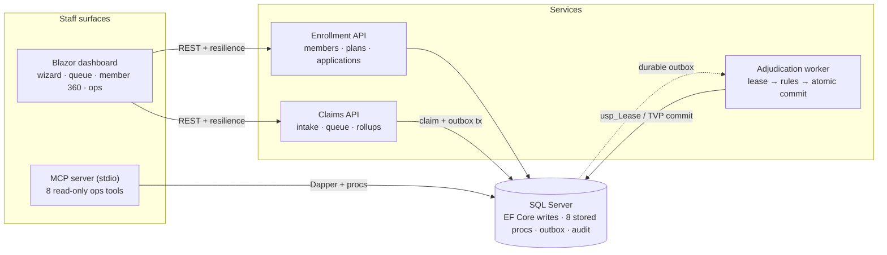

## What it does

Staff submit Medicare **enrollment applications** through a wizard that runs the real eligibility rules before anything is saved — AEP (Oct 15 – Dec 7), ICEP around Part B entitlement, qualifying SEPs with next-month-first effective dates, dual-coverage protection, and five-star switch handling. Applications flow through a guarded state machine to approval.

Providers **submit claims**; the Claims API validates them (real NPI Luhn check-digit, service dates, line rules) and writes the claim and an outbox message in one transaction. The **adjudication worker** atomically leases claims through a stored procedure, runs the rules engine — timely filing (CO-29), coverage verification (CO-27), exact duplicates (CO-18), fee-schedule allowance, then per-line deductible → coinsurance → OOP-max math in integer cents — and commits the entire decision (header, every line, benefit accumulators, audit trail, outbox completion) in a single TVP round trip. Failures release the lease with backoff; five attempts dead-letter the claim for operator review, and the dashboard's claim detail page watches it all happen live.

An **MCP server** exposes the same operational views to AI coding assistants and IDEs — read-only by design, including a dry-run adjudication preview that runs the real engine without writing.

## Quickstart

```bash
./scripts/start.sh        # SQL Server container + all four services + deterministic seed
open http://localhost:8090
```

The seed generates 160 members, 16 plans across two contract years, and ~500 claims whose paid outcomes are priced by the **actual adjudication engine** — accumulators, denial rollups, and YTD figures are internally consistent, not random noise. Claim numbers you can explore immediately: open the claims queue, filter **Received**, and watch the worker drain it while the detail pages update.

| Surface | URL |
|---|---|
| Staff dashboard | http://localhost:8090 |
| Enrollment API (OpenAPI/Scalar) | http://localhost:8080/scalar/v1 |
| Claims API (OpenAPI/Scalar) | http://localhost:8081/scalar/v1 |

Everything else — E2E suite, isolated databases, resets, teardown — is one command each: [`docs/onboarding.md`](docs/onboarding.md).

## The tour

| | |
|---|---|
| 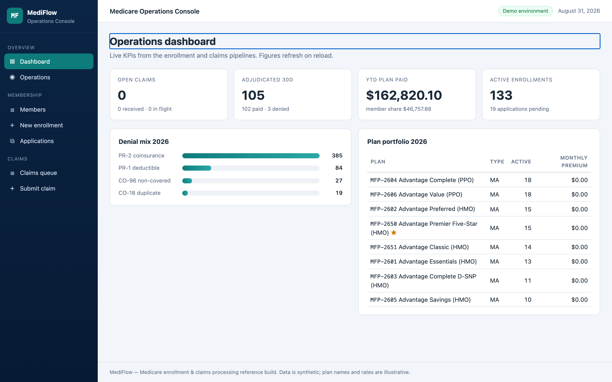 | **Operations dashboard** — pipeline KPIs, denial mix by CO/PR code, plan portfolio with premium volume. |
| 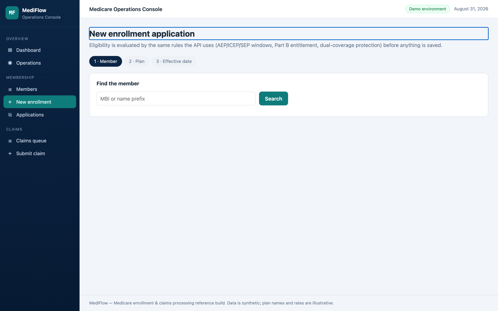 | **Enrollment wizard** — member → plan → effective date, with the eligibility rules evaluating server-side before submission. |
| 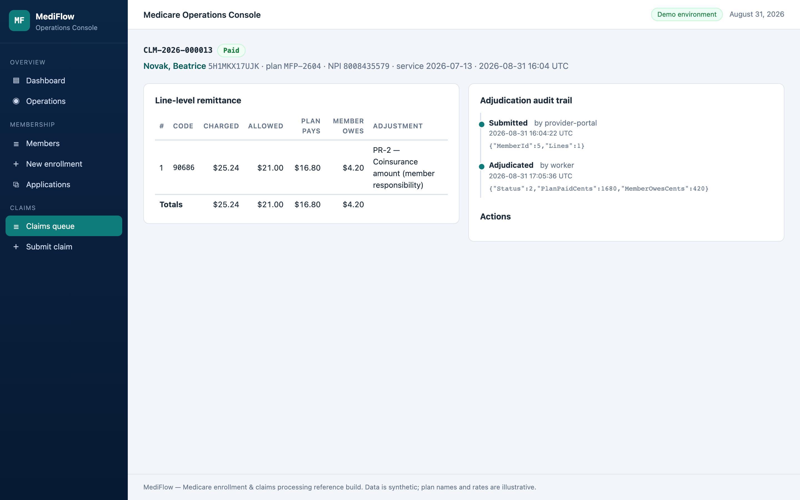 | **Claim detail / EOB** — line-level remittance (allowed, plan pays, member owes, adjustment codes), audit timeline, pend and dry-run preview actions. |
| 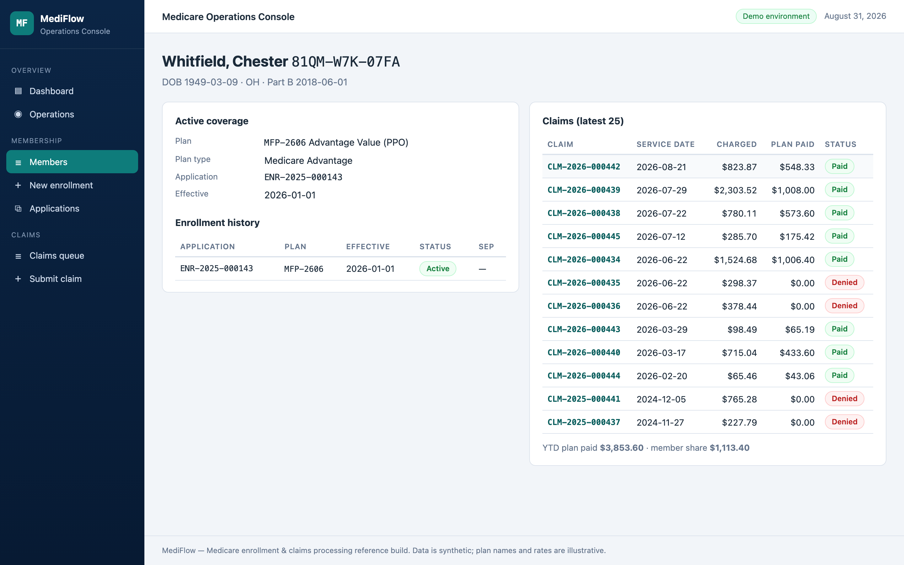 | **Member 360** — active coverage, full enrollment history, claims with YTD totals from one stored procedure. |
| 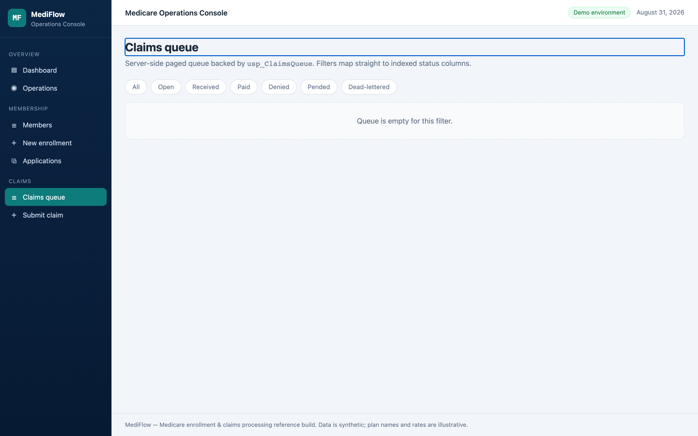 | **Claims queue** — status-filtered, server-paged via `usp_ClaimsQueue`. |
| 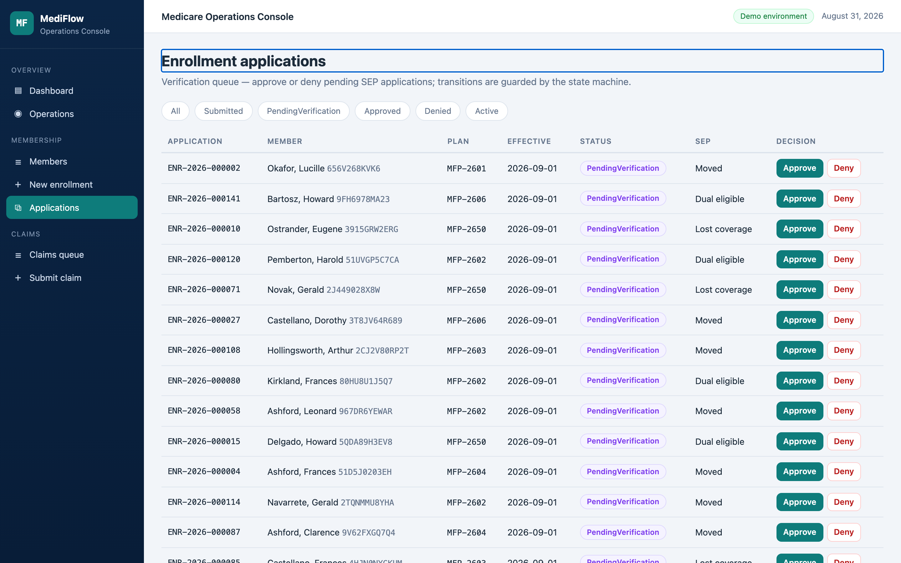 | **Verification queue** — approve or deny pending SEP applications; transitions are state-machine guarded. |
| 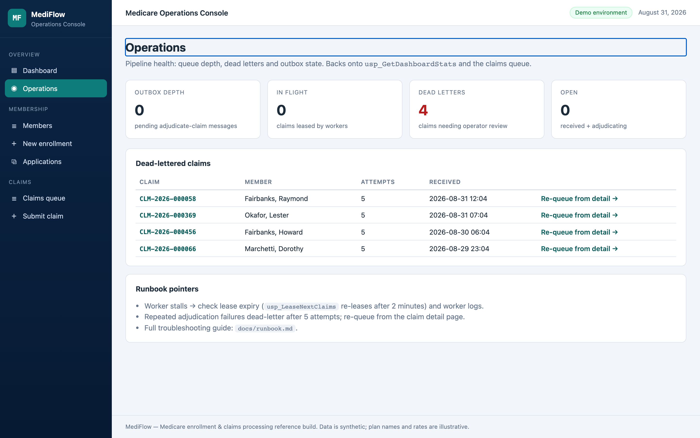 | **Operations** — outbox depth, dead letters with re-queue, runbook pointers. |
| 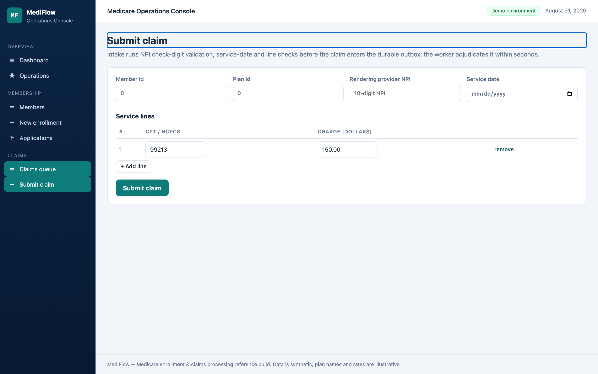 | **Claim intake** — NPI check-digit validation and line rules before anything enters the queue. |

Subject-matter art below is original (fictional carrier, identifiers, amounts):

<p align="center">
  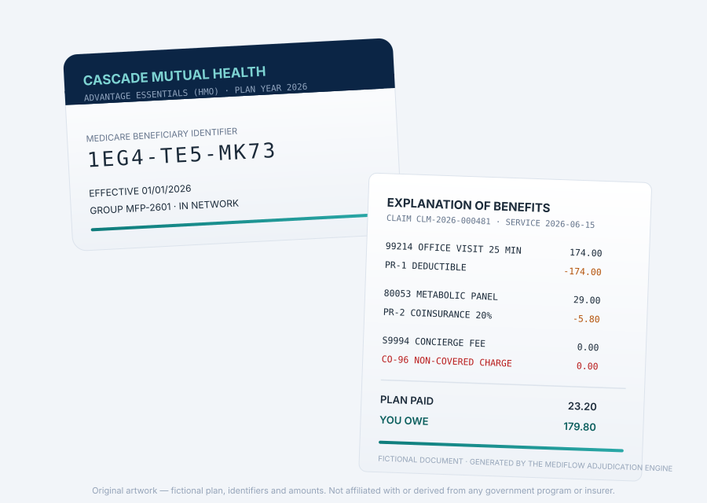
</p>

## Engineering focus

- **Rules as code, tested to the cent.** AEP/ICEP/SEP windows, entitlement, dual coverage, and the benefit calculator (deductible → coinsurance → OOP cap, `MidpointRounding.AwayFromZero`) are pure functions with hand-computed expectations in tests. MBI validation follows the CMS character classes; NPI validation implements the real 80840-prefixed Luhn check digit.
- **Concurrency you can inspect.** Outbox leasing is an atomic CTE update with `READPAST/UPDLOCK`; the commit procedure guards on the lease (`THROW 51002`) and self-heals dead letters. The integration tests assert two workers can never lease the same claim and that a stale-lease commit is rejected.
- **A bug the test pyramid caught.** The adjudication rules were initially registered as concrete DI types, so the engine's rule chain resolved *empty* and every claim silently paid. Unit tests were green; an integration test asserting a coverage denial for an unenrolled member caught it. That story — and the fix — is [ADR 0002](docs/adr/0002-adjudication-rules-pipeline.md) and [docs/design-notes.md](docs/design-notes.md).
- **SQL as a first-class layer.** Eight stored procedures with filtered queue indexes, sargable prefix search, windowed paging counts, and a table-valued-parameter commit — with real `STATISTICS IO` before/after evidence in [docs/query-tuning.md](docs/query-tuning.md).
- **Four test tiers, one command each.** 65 domain unit · 15 integration (Testcontainers SQL Server + WebApplicationFactory) · 10 bUnit · 8 Playwright E2E that bootstrap their own isolated stack via `scripts/e2e.sh` ([docs/testing.md](docs/testing.md)).
- **DevSecOps that already paid out.** Warnings-as-errors include NuGet vulnerability data — during development this rejected a known-vulnerable OpenTelemetry and AngleSharp version at restore time. The pipeline adds CodeQL, Snyk (SCA/SAST/container), gitleaks, dependency review, Dependabot, and SPDX SBOM ([docs/security.md](docs/security.md)).
- **Ready to deploy, honestly scoped.** Dockerfiles (non-root, alpine), full compose stack, Kubernetes manifests with probes and resource limits, and Bicep for Azure Container Apps + Azure SQL + App Insights + Key Vault — with the demo-grade auth boundaries documented as such.

## Documentation

| Doc | Contents |
|---|---|
| [docs/architecture.md](docs/architecture.md) | Context/container views, request lifecycle walkthrough |
| [docs/onboarding.md](docs/onboarding.md) | Day-one setup, repo tour, add-a-feature walkthrough |
| [docs/domain.md](docs/domain.md) | Medicare concepts, CO/PR codes, worked adjudication example |
| [docs/query-tuning.md](docs/query-tuning.md) | Index decisions with measured before/after reads |
| [docs/mcp-server.md](docs/mcp-server.md) | The 8 tools, client wiring, safety model |
| [docs/security.md](docs/security.md) | Auth model, pipeline, threat notes |
| [docs/runbook.md](docs/runbook.md) | Incident playbooks, metrics, escalation thresholds |
| [docs/testing.md](docs/testing.md) | Running and writing tests in every tier |
| [docs/design-notes.md](docs/design-notes.md) | Hard problems and how they were resolved |
| [docs/adr/](docs/adr/) | Eight architecture decision records |

## What this project demonstrates

| Capability | Where |
|---|---|
| Enterprise C# / ASP.NET Core, minimal APIs | `src/MediFlow.Api`, `src/MediFlow.Claims.Api` |
| Blazor web apps | `src/MediFlow.Blazor` (QuickGrid, interactive server, wizard, live claim polling) |
| Full-stack ownership | Domain → EF Core + stored procedures → REST → Blazor |
| Advanced SQL Server | 8 stored procs, TVP commit, filtered indexes, measured tuning |
| Microservices + REST | Two APIs + worker sharing contracts, resilient typed clients |
| Unit + integration testing | 90 automated tests across three tiers, Testcontainers, 80% domain coverage gate |
| Cloud (Azure) | Bicep IaC for Container Apps / Azure SQL / App Insights / Key Vault; OTel throughout |
| CI/CD + DevSecOps | CodeQL, Snyk, gitleaks, SBOM, Dependabot, GHCR publishing, non-root images |
| Design patterns / secure coding | Rules pipeline, outbox, state machines, constant-time key checks, warnings-as-errors |
| Troubleshooting / operations | Runbook, custom OTel metrics, audit trail, dead-letter tooling |
| Copilot & MCP servers | Read-only MCP server with 8 tools + `.github/copilot-instructions.md` |

---

All data is synthetic. Plan names, carriers, rates, MBIs, and NPIs are generated; "Cascade Mutual Health" and "Northbridge Care Network" are fictional. This project is not affiliated with any government program or insurer.
