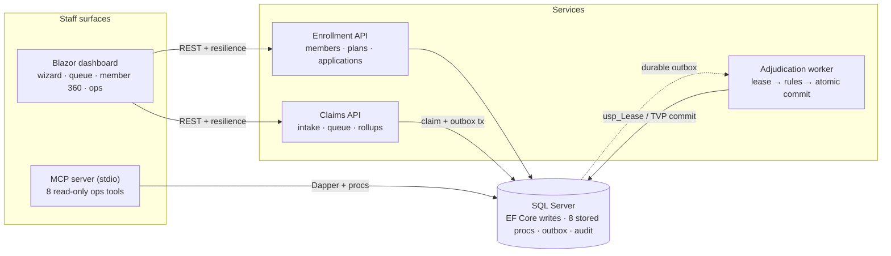

# MediFlow: the engineering view

The companion to the [README's product story](README.md): the architecture, the request
path a claim travels, and every major engineering decision traced back to the Medicare
operations problem it exists to solve. Decision records and the deeper docs are linked
throughout rather than duplicated; nothing here replaces them.

## Architecture

The textual source of truth for the same picture, kept as Mermaid next to the animated
SVG (update the two together):

The components, in flow order:

- **`MediFlow.Blazor`, the staff dashboard (:8090).** The only interface staff use:
  enrollment wizard, claims queue, member 360, operations. Interactive server rendering;
  a pure REST consumer of both APIs through typed `HttpClient` clients with standard
  resilience handlers and an API-key header.
- **`MediFlow.Api`, the enrollment API (:8080).** Members, plans, and enrollment
  applications. Runs the domain's eligibility rules and writes enrollments plus audit
  rows through EF Core; the one service per environment that bootstraps the database
  (migrations, procedures, optional seed) so concurrent boots do not race.
- **`MediFlow.Claims.Api`, the claims API (:8081).** Intake, queue, detail, dry-run
  preview, pend, requeue, rollups. Intake writes claim + lines + outbox message + audit
  in one transaction and returns `202` with the claim number.
- **SQL Server.** One database: EF Core writes on the OLTP side, eight stored procedures
  for hot reads plus the worker's lease and commit procedures, the outbox, the append-only
  audit log, and benefit accumulators. Services share the database but own disjoint write
  paths ([ADR 0001](docs/adr/0001-modular-service-boundaries.md),
  [ADR 0003](docs/adr/0003-ef-core-writes-dapper-proc-reads.md)).
- **`MediFlow.Worker`, the adjudication worker.** Stateless replicas (two in
  `deploy/k8s`) that poll the outbox (5 s busy, 15 s idle), lease batches of 10 through
  `usp_LeaseNextClaims`, run the engine, and commit through
  `usp_RecordAdjudicationResult`.
- **`MediFlow.Mcp`, the MCP server.** A stdio tool host with eight read-only operational
  tools over the same Dapper reads and domain rules the dashboard uses; the one stateful
  operation, adjudication, is exposed only as a no-write preview
  ([docs/mcp-server.md](docs/mcp-server.md)).

Shared libraries (`MediFlow.Domain`, `MediFlow.Contracts`, `MediFlow.Infrastructure`)
are referenced by the containers, not deployed themselves. The full context and container
views, observability setup, and deployment story live in
[docs/architecture.md](docs/architecture.md).

## How the tech solves the business problem

| Business problem | Engineering decision | Why this tech | What it buys | Where documented |
|---|---|---|---|---|
| A claim handoff must never be lost or double-processed; the human consequence is a provider not paid, or paid twice | Transactional outbox with SQL leasing: intake writes claim + lines + outbox message + audit in one EF Core transaction; workers lease batches via `usp_LeaseNextClaims` (`READPAST`/`UPDLOCK`, 2-minute lease tokens); the commit procedure accepts results only from the current lease holder | The database already owns the transactions and locking; a broker would add a runtime dependency to a system whose durability is already SQL Server's job | Two workers never lease the same claim; a crashed worker's lease lapses and the claim re-queues with attempts already counted; five attempts dead-letter for operator review; a self-healing sweep catches orphans of workers that crashed before releasing | [ADR 0005](docs/adr/0005-transactional-outbox-leasing.md) |
| A 20-line claim must price in one round trip so nothing is half-applied | One stored procedure, `usp_RecordAdjudicationResult`, commits the entire decision; line outcomes travel as a table-valued parameter and the procedure guards on the lease token (`THROW 51002` on mismatch) | The guard and the five writes it authorizes sit in the same script; EF Core would need several round trips and the lease check expressed as optimistic client logic | Readers (queue, dashboard stats, member 360) never observe an intermediate state: no half-paid claim, no accumulator advanced without its audit row, no way to add a write path that forgets the guard | [ADR 0006](docs/adr/0006-tvp-atomic-commit.md) |
| The rules pipeline can fail silently: registered wrong, the rule chain once resolved empty and every claim was paid | Ordered DI rules pipeline: `AdjudicationEngine` materializes `IEnumerable<IAdjudicationClaimRule>` once and evaluates in registration order, first denial wins, every line inherits the code; integration tests resolve from the real container and the engine exposes `Rules` for inspection | The failure lived in wiring, not class behavior; unit tests that construct the engine directly cannot see composition regressions | Denial codes and the audit trail are trustworthy because the chain is provably non-empty at the DI boundary; adding a rule is one class plus one registration line, reviewed in one place | [ADR 0002](docs/adr/0002-adjudication-rules-pipeline.md), [ADR 0008](docs/adr/0008-testing-strategy.md) |
| Money must never round wrong: percentage splits create half-cents that compound line by line and across claims | Integer cents end to end with one rounding point: `Money.PercentOf` with `MidpointRounding.AwayFromZero`; `int` columns in the schema and the TVP | `float`/`double` drift on 0.1; `decimal` is exact but leaks scale questions and still needs a rounding policy; integers make engine, SQL, and tests agree by construction | The engine's `LineDecision` cents are the integers the commit writes; accumulators carry exact amounts forward; a disputed cent has one line of code to point at | [ADR 0004](docs/adr/0004-money-as-cents.md) |
| Hot staff-facing reads (member search, work queue, rollups, dashboard KPIs) are projection-shaped, not entity-shaped | EF Core for writes (model, migrations, unique and filtered indexes) plus eight stored procedures through Dapper for reads | EF is right where the model is the point (schema evolution, transactional aggregates); procedures are right where the query is the point (one round trip, window functions, multi-result-set reads, a tuning surface that moves without recompiling C#) | Queue, search, and dashboard stay predictable; procedures ship as embedded resources in the assembly that calls them, so an app version and its SQL can never skew; measured evidence in [docs/query-tuning.md](docs/query-tuning.md) | [ADR 0003](docs/adr/0003-ef-core-writes-dapper-proc-reads.md) |
| Two APIs with identical cross-cutting needs drift apart; one gets a hardening fix, the other quietly does not | One shared web plumbing: `AddMediFlowWebService` / `UseMediFlowWebService` compose Serilog, OpenAPI + Scalar, rate limiting, API-key middleware, health endpoints, security headers, and OpenTelemetry for both hosts | The classic failure mode is divergence between hand-rolled `Program.cs` files; a single composition point makes drift impossible | A security or observability change lands once and applies to both APIs on the next build; a third API is two lines in its `Program.cs` | [ADR 0007](docs/adr/0007-shared-web-service-plumbing.md) |
| Batch adjudication throughput must not compete with staff clicking the dashboard | One repository, four containerized deployables sharing contracts and one database with disjoint write paths | A single deployable couples the queue drain to HTTP handling; six repositories adds package-feed overhead at this scale | The worker scales independently (two replicas in `deploy/k8s`) against the same leasing procedures; only worker throughput is affected by queue depth | [ADR 0001](docs/adr/0001-modular-service-boundaries.md) |
| Risk concentrates in four different places: pure rules, SQL semantics, DI wiring, the user journey | Four test tiers, each owning one failure class; the cheapest tier absorbs the most cases | No single test style observes all four; the empty-chain bug proved wiring is behavior only the hosted-API tier catches | A behavior change ships with its validating test in the same PR; an 80% domain line-coverage gate fails the build | [ADR 0008](docs/adr/0008-testing-strategy.md), [docs/testing.md](docs/testing.md) |

The row that shaped the system most is the first one. "A submitted claim must eventually be
adjudicated exactly once, even when processes crash" is the requirement the rest of the
architecture answers to, and the outbox plus leasing covers every crash point: crash after
intake (the message is still pending; the next poll leases it), crash after lease before
commit (the 2-minute lease lapses and the claim is re-leased with attempts already
advanced, bounding retries), crash during commit (the procedure's transaction rolls back
atomically), crash after commit (the outbox is already completed; no re-lease), and two
workers racing (the `READPAST`/`UPDLOCK` leasing makes double-leasing impossible, and the
commit-time token guard rejects any result that slips through an expired lease). The
trade, recorded honestly in the ADR: exactly-once *processing intent* over at-least-once
*delivery*, poll latency instead of a broker, and two worker-side procedures that must
stay in sync with the EF model.

The third row is the war story worth retelling. During development the adjudication rules
were registered as their concrete types (`AddScoped<FilingTimelinessRule>()` and so on).
The default container resolves `IEnumerable<IAdjudicationClaimRule>` from interface
registrations only, so the engine received an empty array, and an engine with no rules
never denies anything: it fails silent, not loud, and every claim priced as if covered.
Every domain unit test stayed green because they construct the engine directly with
explicit rule instances. What caught it was an integration test asserting that a claim for
a member with no enrollment previews as a coverage denial; with the empty chain, that
claim priced instead. The registrations were corrected, the engine now exposes `Rules` so
the resolved chain can be inspected at the boundary, and the lesson is baked into the
testing strategy: wiring is behavior, and only tests that resolve from the real container
catch composition regressions.

## How a request flows

One representative path, a claim from submission to Paid (distilled from
[docs/architecture.md](docs/architecture.md)):

1. **Submit.** Staff submit on the dashboard's intake page; the Blazor client POSTs to
   the Claims API. `ClaimSubmissionRules` rejects unadjudicatable work up front (NPI
   check digit, member and plan present, service dates, line rules) with a validation
   problem; otherwise the intake transaction commits (claim and lines as `Received`, the
   `adjudicate-claim` outbox message, the "Submitted" audit row) and the API returns
   `202` with the claim number.
2. **Queue.** The worker's next poll leases up to 10 pending messages atomically and
   flips the claims to `Adjudicating`. Concurrent replicas can never lease the same
   claim.
3. **Assemble.** The runner loads everything the pure engine needs: the claim with
   member, plan, and lines; the active enrollment covering the service date; the fee
   schedule for the service year; the member's benefit accumulators; and duplicate
   fingerprints from prior claims.
4. **Adjudicate.** The engine runs the claim rules in order: filing timeliness (CO-29),
   coverage (CO-27), exact duplicate (CO-18). The first hit denies the whole claim and
   every line inherits the code. If no rule denies, `BenefitCalculator` prices each line:
   fee-schedule allowance, then deductible, then coinsurance in integer cents, capped by
   the out-of-pocket maximum, advancing the accumulators line by line.
5. **Commit.** One call to `usp_RecordAdjudicationResult` carries the header totals plus
   a TVP of line results and atomically writes the outcome, every line, the accumulator
   upsert, an "Adjudicated" audit entry, and the outbox completion. A stale lease throws
   `51002` and the claim stays queued.
6. **Observe.** The dashboard's overview reads the rollups procedure (queue depth,
   denial mix, dead letters, YTD dollars, outbox depth), the queue page reads the paged
   queue procedure, and the claim detail page shows line-level remittance with the audit
   timeline. The MCP `get_claim` tool replays the same detail for operational questions.

The enrollment side's representative path is shorter and shares the shape: the wizard
calls an eligibility check that runs `EnrollmentRules.Validate`, the same pure function
the API, the pre-check endpoint, and the MCP eligibility tool answer from, so all three
surfaces can never disagree. Every state change on either side lands in `AuditEntries`,
an append-only log keyed by entity and business key with the actor, timestamp, and a JSON
detail payload; there is no path that mutates or deletes audit rows.

## Stack, and why

| Area | Choice and why |
|---|---|
| **.NET 10, minimal APIs** | Two small REST hosts (`MediFlow.Api`, `MediFlow.Claims.Api`) sharing one contracts library and one web plumbing composition point ([ADR 0001](docs/adr/0001-modular-service-boundaries.md), [ADR 0007](docs/adr/0007-shared-web-service-plumbing.md)) |
| **Blazor (interactive server)** | The staff console: wizard, QuickGrid queues, live claim polling; a pure REST consumer with standard resilience handlers |
| **SQL Server + EF Core + Dapper** | EF Core owns writes, migrations, and the unique/filtered indexes; eight stored procedures through Dapper own the hot reads; the lease and TVP-commit procedures own worker safety ([ADR 0003](docs/adr/0003-ef-core-writes-dapper-proc-reads.md), [ADR 0005](docs/adr/0005-transactional-outbox-leasing.md), [ADR 0006](docs/adr/0006-tvp-atomic-commit.md)) |
| **Money as integer cents** | One rounding convention (`MidpointRounding.AwayFromZero`) in one place; engine, SQL, and tests agree to the cent by construction ([ADR 0004](docs/adr/0004-money-as-cents.md)) |
| **ModelContextProtocol C# SDK (stdio)** | The read-only ops tool surface: eight tools plus dry-run eligibility and adjudication previews that run real domain logic without writing ([docs/mcp-server.md](docs/mcp-server.md)) |
| **Serilog + OpenTelemetry** | Structured logs per service, OTLP traces and metrics when an endpoint is configured, and a worker meter (claims adjudicated, duration, failures) |
| **Testcontainers + WebApplicationFactory + bUnit + Playwright** | The four test tiers; SQL semantics are tested against real SQL Server, not a substitute ([ADR 0008](docs/adr/0008-testing-strategy.md)) |
| **Docker / compose, Kubernetes, Bicep** | Non-root Alpine images, a full compose stack, k8s manifests with probes and limits, and Bicep for Azure Container Apps + Azure SQL + App Insights + Key Vault |

### What this project demonstrates

| Capability | Where |
|---|---|
| Enterprise C# / ASP.NET Core, minimal APIs | `src/MediFlow.Api`, `src/MediFlow.Claims.Api` |
| Blazor web apps | `src/MediFlow.Blazor` (QuickGrid, interactive server, wizard, live claim polling) |
| Full-stack ownership | Domain → EF Core + stored procedures → REST → Blazor |
| Advanced SQL Server | 8 stored procs, TVP commit, filtered indexes, measured tuning |
| Microservices + REST | Two APIs + worker sharing contracts, resilient typed clients |
| Unit + integration testing | 98 automated tests across four tiers, Testcontainers, 80% domain coverage gate |
| Cloud (Azure) | Bicep IaC for Container Apps / Azure SQL / App Insights / Key Vault; OTel throughout |
| CI/CD + DevSecOps | CodeQL, Snyk, gitleaks, SBOM, Dependabot, GHCR publishing, non-root images |
| Design patterns / secure coding | Rules pipeline, outbox, state machines, constant-time key checks, warnings-as-errors |
| Troubleshooting / operations | Runbook, custom OTel metrics, audit trail, dead-letter tooling |
| Copilot & MCP servers | Read-only MCP server with 8 tools (`src/MediFlow.Mcp`, [docs/mcp-server.md](docs/mcp-server.md)) |

## Testing

Four tiers, each owning a distinct failure class; counts are current:

- **65 domain unit tests** (`tests/MediFlow.Domain.UnitTests`): enrollment windows,
  adjudication rules, benefit math, MBI/NPI/Money value objects. Pure, deterministic, no
  clock (rules take `asOfUtc` as an argument); CI enforces an 80% line-coverage threshold
  on this project via a coverlet.msbuild gate that fails the build below it (the suite
  currently measures 80.7%).
- **15 integration tests** (`tests/MediFlow.IntegrationTests`): one Testcontainers SQL
  Server per assembly (azure-sql-edge on arm64, mssql 2022 on CI), migrated, proc-loaded,
  and seeded by the same bootstrap the enrollment API runs; two `WebApplicationFactory`
  hosts boot the real APIs with API-key enforcement on. This tier owns everything SQL- or
  DI-shaped: procedure behavior, the lease/commit/fail-lease lifecycle including the
  wrong-token `51002` rejection, and the dry-run preview contract.
- **10 bUnit component tests** (`tests/MediFlow.Blazor.UnitTests`): the presentational
  shell (status badges across all claim and enrollment states, pager behavior) without a
  browser.
- **8 Playwright E2E specs** (`e2e/`): `scripts/e2e.sh` recreates an isolated
  `MediFlow_E2E` database, boots all four services, waits on health, and drives the real
  dashboard; traces and screenshots are retained on failure.

`dotnet test` at the root runs the first three together; every tier runs in CI on each
push and PR. Conventions for writing each kind, including the Blazor circuit handshake
that E2E specs must wait for, are in [docs/testing.md](docs/testing.md).

## Security and operations

- **Two-tier auth, honestly scoped.** Demo-grade locally: a shared API key checked in
  constant time (`CryptographicOperations.FixedTimeEquals`) by `ApiKeyMiddleware`, 401
  ProblemDetails with no detail about what failed, a 100/min fixed-window rate limiter,
  and an anonymous allowlist limited to health and docs prefixes. The production path is
  documented, not hand-waved: Entra ID OIDC with per-scope policies, swapped at the one
  composition point ([docs/security.md](docs/security.md)).
- **Pipeline gates on every push and PR** (`security.yml`): CodeQL SAST
  (`security-extended`), Snyk SCA/SAST/container, gitleaks over the full git history,
  GitHub dependency review on PRs, Dependabot update PRs, and an SPDX SBOM artifact.
- **Warnings as errors, including vulnerability data.** `TreatWarningsAsErrors` makes
  NuGet audit findings (`NU1902`-class) hard build failures; during development this
  rejected a known-vulnerable OpenTelemetry and AngleSharp version at restore time,
  before either could land.
- **Least-privilege surfaces.** Parameterized SQL everywhere (Dapper, EF, raw
  `SqlParameter` arrays including the TVP); non-root Alpine containers with
  `runAsNonRoot` and read-only root filesystems in k8s; the MCP server is read-only by
  design, with adjudication exposed only as a dry-run preview pinned by an integration
  test.
- **Operations.** Dead letters surface on the dashboard's operations page with requeue;
  the runbook ([docs/runbook.md](docs/runbook.md)) carries incident playbooks, metrics,
  and escalation thresholds; Serilog plus OTel give per-service traces and a worker meter.

## Jargon

Terms used across this repo, from [adjudication](docs/GLOSSARY.md) and
[CO/PR codes](docs/GLOSSARY.md) to [transactional outbox](docs/GLOSSARY.md),
[leasing](docs/GLOSSARY.md), and [TVP](docs/GLOSSARY.md), are defined in the
[glossary](docs/GLOSSARY.md), plain English first; every term this page uses is
covered there.

## Documentation map

| Document | What it covers |
|---|---|
| [docs/architecture.md](docs/architecture.md) | Context/container views, request lifecycle walkthrough |
| [docs/onboarding.md](docs/onboarding.md) | Day-one setup, repo tour, add-a-feature walkthrough |
| [docs/domain.md](docs/domain.md) | Medicare concepts, CO/PR codes, worked adjudication example |
| [docs/query-tuning.md](docs/query-tuning.md) | Index decisions with measured before/after reads |
| [docs/mcp-server.md](docs/mcp-server.md) | The 8 tools, client wiring, safety model |
| [docs/security.md](docs/security.md) | Auth model, pipeline, threat notes |
| [docs/runbook.md](docs/runbook.md) | Incident playbooks, metrics, escalation thresholds |
| [docs/testing.md](docs/testing.md) | Running and writing tests in every tier |
| [docs/design-notes.md](docs/design-notes.md) | Hard problems and how they were resolved |
| [docs/adr/](docs/adr/) | Eight architecture decision records: [0001 service boundaries](docs/adr/0001-modular-service-boundaries.md), [0002 rules pipeline](docs/adr/0002-adjudication-rules-pipeline.md), [0003 EF writes + proc reads](docs/adr/0003-ef-core-writes-dapper-proc-reads.md), [0004 money as cents](docs/adr/0004-money-as-cents.md), [0005 outbox + leasing](docs/adr/0005-transactional-outbox-leasing.md), [0006 TVP commit](docs/adr/0006-tvp-atomic-commit.md), [0007 shared plumbing](docs/adr/0007-shared-web-service-plumbing.md), [0008 testing strategy](docs/adr/0008-testing-strategy.md) |
