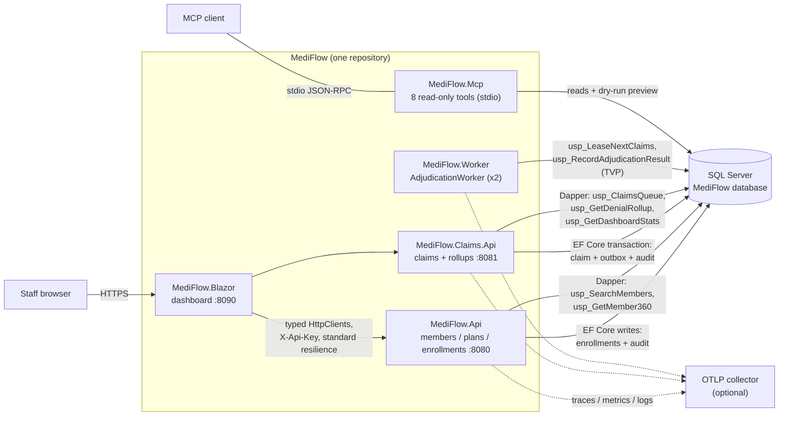

# MediFlow Architecture

MediFlow is a Medicare enrollment and claims adjudication reference platform:
staff enroll beneficiaries into plans under Medicare's eligibility windows,
providers submit claims, a worker adjudicates those claims through a rules
pipeline and prices them against plan benefits, and the dashboard shows the
whole operation — queue depth, denial mix, enrollment pipeline, and per-claim
remittance with a full audit trail.

## Context view

Staff use a Blazor dashboard as their only interface. Everything else is a
consequence of one requirement: a submitted claim must eventually be adjudicated
exactly once, even when processes crash. That requirement produces the two most
distinctive parts of the system — the transactional outbox that couples claim
intake to work queuing, and the SQL leasing/TVP-commit procedures that make a
pool of workers safe without a message broker.

The platform is a portfolio-scale reference implementation: one repository,
four containerized deployables, one shared SQL Server database, and an MCP tool
host that lets an MCP client answer operational questions read-only.

## Container view

The same diagram is kept as a standalone file for rendering outside this
document: `docs/diagrams/architecture.mmd`.

### Containers

| Container | Purpose | Notes |
| --- | --- | --- |
| `MediFlow.Blazor` | Staff dashboard (interactive server rendering) | Pure REST consumer of both APIs via typed `HttpClient` clients with `AddStandardResilienceHandler` (retry + circuit breaker) and an `ApiKeyHandler` that attaches `X-Api-Key` |
| `MediFlow.Api` | Enrollment-side REST API: `/api/v1/members`, `/api/v1/plans`, `/api/v1/enrollments` | Runs eligibility rules from `MediFlow.Domain`; writes enrollments and audit rows through EF Core |
| `MediFlow.Claims.Api` | Claims REST API: `/api/v1/claims` (submit, queue, detail, preview, pend, requeue), `/api/v1/rollups` | Intake writes claim + lines + outbox message + audit in one transaction |
| `MediFlow.Worker` | Background adjudication of leased claims | Stateless replicas (2 in `deploy/k8s`); polls every 5 s (15 s idle), 2-minute leases, batches of 10 |
| `MediFlow.Mcp` | MCP server over stdio, 8 tools (member search, member 360, eligibility pre-check, claims queue, claim detail, adjudication dry-run, denial rollup, denial-code explainer) | Read-only by design; the one stateful operation — adjudication — is exposed only as a no-write preview |
| SQL Server | Single operational database | Owned schema objects: `Members`, `Plans`, `Enrollments`, `Claims`, `ClaimLines`, `ProcedureFees`, `BenefitAccumulators`, `Outbox`, `AuditEntries`, plus 8 stored procedures and the `dbo.AdjudicationLineResultType` TVP |

Shared libraries (`MediFlow.Domain`, `MediFlow.Contracts`, `MediFlow.Infrastructure`)
are referenced by the containers rather than deployed themselves. Boundaries,
scaling trade-offs, and the shared-database decision are recorded in
[ADR 0001](adr/0001-modular-service-boundaries.md).

### How the containers share the database

All containers point at one SQL Server database but own disjoint write paths:
enrollment state is written only by `MediFlow.Api`, claim intake only by
`MediFlow.Claims.Api`, and adjudication outcomes only by the worker, through
the leasing procedures that guard every commit with a lease token. Hot read
paths (search, queues, rollups, dashboard) are stored procedures invoked
through Dapper — see
[ADR 0003](adr/0003-ef-core-writes-dapper-proc-reads.md). In any environment,
exactly one service performs boot-time bootstrap (migrations, procedures,
optional seed) so concurrent boots do not race; the rest set
`Database__InitializeOnStartup=false`.

Both APIs share one service-host implementation — Serilog, OpenAPI + Scalar,
rate limiting, constant-time API-key middleware, health endpoints, security
headers, OpenTelemetry — so their plumbing cannot drift
([ADR 0007](adr/0007-shared-web-service-plumbing.md)).

## Observability

Every HTTP service and the worker write Serilog structured logs enriched with
a service name (`mediflow-api`, `mediflow-claims-api`, `mediflow-worker`,
`mediflow-blazor`). OpenTelemetry traces (ASP.NET Core, HttpClient, SqlClient)
and metrics are exported over OTLP when `OTEL_EXPORTER_OTLP_ENDPOINT` is
configured — as in compose or the Azure deployment — and stay local otherwise.
The worker publishes its own meter (`MediFlow.Worker`): claims adjudicated,
adjudication duration, and adjudication failures, which the APIs' shared
telemetry configuration also subscribes to.

## The outbox path

Claim acceptance and claim adjudication are decoupled by the `Outbox` table
([ADR 0005](adr/0005-transactional-outbox-leasing.md)):

1. `POST /api/v1/claims` validates the submission and, in one EF Core
   transaction, writes the `Claims`/`ClaimLines` rows (status `Received`), an
   `OutboxMessage` of type `adjudicate-claim`, and a "Submitted" `AuditEntries`
   row. The API returns `202 Accepted` with the claim number.
2. `MediFlow.Worker` polls `usp_LeaseNextClaims`, which atomically leases up to
   10 pending messages (`READPAST`/`UPDLOCK`), stamps a lease token and a
   2-minute expiry, increments the attempt count, and flips the leased claims
   to `Adjudicating`. Concurrent replicas can never lease the same claim.
3. After the engine produces a decision, `usp_RecordAdjudicationResult` commits
   it in one call guarded by the lease token ([ADR 0006](adr/0006-tvp-atomic-commit.md)).
4. Failures release the lease with a retry delay; five attempts dead-letter the
   claim with an audit row. A sweep inside the lease procedure dead-letters
   claims orphaned by crashed workers. Dead letters surface on the dashboard's
   operations page and can be requeued with `POST /api/v1/claims/{id}/adjudicate`.

The `IX_Outbox_Pending` filtered index (`[CompletedAtUtc] IS NULL`) and the
`IX_Claims_Queue` filtered index (`[Status] IN (0, 1)`) keep both scans off
completed and historical rows.

## Request lifecycle: a claim from submission to Paid

1. **Submit.** Staff submit a claim on the dashboard's submit page. The Blazor
   client POSTs to `MediFlow.Claims.Api` `/api/v1/claims`. `ClaimSubmissionRules`
   rejects unadjudicatable work up front (NPI check digit, member and plan
   present, line rules) with a validation problem; otherwise the intake
   transaction described above commits and the dashboard shows the new claim
   number, status `Received`.
2. **Queue.** The worker leases the outbox message within one poll interval
   (about 5 seconds when busy) and moves the claim to `Adjudicating`.
3. **Assemble.** `ClaimAdjudicationRunner` loads the claim with member, plan,
   and lines, the active enrollment covering the service date, the fee schedule
   for the service year, the member's benefit accumulators, and duplicate
   fingerprints from prior claims — everything the pure engine needs.
4. **Adjudicate.** `AdjudicationEngine` runs the claim rules in order —
   FilingTimeliness (CO-29), Coverage (CO-27), Duplicate (CO-18)
   ([ADR 0002](adr/0002-adjudication-rules-pipeline.md)). The first hit denies
   the whole claim and every line inherits the code. If no rule denies,
   `BenefitCalculator` prices each line: fee-schedule allowance, then deductible,
   then coinsurance (integer cents, `MidpointRounding.AwayFromZero` at half-cent
   boundaries — [ADR 0004](adr/0004-money-as-cents.md)), capped by the
   out-of-pocket maximum, advancing accumulators line by line.
5. **Commit.** One call to `usp_RecordAdjudicationResult` carries the header
   totals plus a TVP of line results and atomically writes the claim outcome,
   every line, the accumulator upsert, an "Adjudicated" audit entry, and the
   outbox completion. Other readers never observe an intermediate state; a
   stale lease is rejected with SQL error 51002 and the claim stays queued.
6. **Observe.** The dashboard's overview calls `/api/v1/rollups/dashboard`
   (`usp_GetDashboardStats`: queue depth, 30-day throughput, denial rate,
   dead letters, YTD dollars, outbox depth) and the claims queue calls
   `/api/v1/claims/queue` (`usp_ClaimsQueue`). The claim detail page shows
   status `Paid` with line-level remittance — allowed, plan paid, member owes —
   and the audit trail: `Submitted (provider-portal) → Adjudicated (worker)`.

## Audit trail

`AuditEntries` is an append-only log keyed by entity type and business key
(claim number, application number). Every state change writes a row — claim
submitted, pended, adjudicated, dead-lettered; enrollment submitted, approved,
denied — with the actor (a staff identity, `worker`, or a service name), a
timestamp, and a JSON detail payload (denial codes, totals, notes). The claim
detail page renders the sequence, and the MCP `get_claim` tool replays it for
operational questions. There is no path that mutates or deletes audit rows.

## Decisions

Architecturally significant decisions are recorded in
[`docs/adr/`](adr/0001-modular-service-boundaries.md):

- [0001 — Modular service boundaries](adr/0001-modular-service-boundaries.md)
- [0002 — Adjudication rules pipeline](adr/0002-adjudication-rules-pipeline.md)
- [0003 — EF Core writes, stored-procedure reads](adr/0003-ef-core-writes-dapper-proc-reads.md)
- [0004 — Money as cents](adr/0004-money-as-cents.md)
- [0005 — Transactional outbox with leasing](adr/0005-transactional-outbox-leasing.md)
- [0006 — TVP atomic commit](adr/0006-tvp-atomic-commit.md)
- [0007 — Shared web service plumbing](adr/0007-shared-web-service-plumbing.md)
- [0008 — Testing strategy](adr/0008-testing-strategy.md)

## Deployment

`docker-compose.yml` brings up the full stack — SQL Server, both APIs, the
worker, and the dashboard — with deterministic seed data; only the enrollment
API bootstraps the database. `deploy/k8s` contains the Kubernetes manifests
(the worker runs two replicas; the shared plumbing makes both APIs
health-probeable at `/health/live` and `/health/ready`), and `infra/main.bicep`
describes the Azure environment. CI builds the four deployable images, runs the
four test tiers, and executes the self-bootstrapping Playwright suite via
`scripts/e2e.sh` against an isolated `MediFlow_E2E` database.
